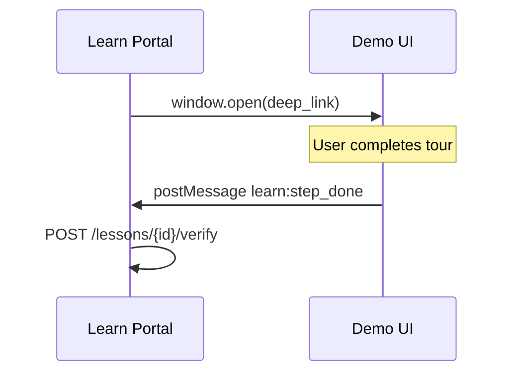

# Integration map: Author Constructor ↔ Demo ↔ Capture

**Статус:** Planner  
**Связанные документы:** [demo-bridge.md](../learn/demo-bridge.md), [integration-map.md](../learn/integration-map.md), [content-authoring.md](../learn/content-authoring.md)

---

## 1. Preview flow

### 1.1. Student preview (существует)

```
AuthorLessonPage
  → link «Превью для ученика»
  → GET /lessons/{id}?preview=1  (new tab)
  → LessonPage (isPreview=true)
  → no startLesson / verify / quiz persist
```

**Файлы:** `AuthorLessonPage.tsx` (href), `LessonPage.tsx` (`searchParams preview`).

### 1.2. Inline preview (Phase 2)

```
AuthorLessonPage center column
  → LessonSlideView mode="author"
  → SlideCarousel + ScreenshotGuide (same as student)
  → caption via LessonHtml, ExpectedResult
```

**Паритет:** визуально идентично `LessonPage` central column; без `LessonActions` verify calls.

### 1.3. Draft preview (Phase 3 — TBD)

```
AuthorLessonPage
  → «Превью черновика»
  → GET /lessons/{id}?draft=1&preview=1
  → backend reads lesson_drafts.draft_json
```

---

## 2. Demo bridge (navigation verify)

### 2.1. Production flow (ученик)



**Конфиг урока:**
- `lessons.deep_link_template` — URL с `?learn_step=`
- `lessons.verify_config.learn_step` — match key

**Файлы:**
- `frontend/src/utils/learnBridge.ts` — `listenForLearnStepDone`
- `frontend/src/utils/deepLink.ts` — `buildDeepLink`
- `frontend/src/pages/LessonPage.tsx` — listener → `handleVerify`

### 2.2. Author tester (Phase 2)

```
DemoBridgeTesterPanel (AuthorLessonPage meta column)
  → user enters step id
  → simulates postMessage on same window
  → shows whether verify.config.learn_step would match
```

**Ограничение:** полный E2E требует opener/opener chain (превью + демо). Тестер — sanity check для методиста, не замена E2E.

**Инструкция в UI (RU):**
1. Откройте «Превью для ученика»
2. Откройте демо по deep link
3. После действия в демо — verify сработает автоматически (если демо шлёт postMessage)

### 2.3. Deep link builder ↔ verify sync

| verify type | deep_link_template | verify_config |
|-------------|-------------------|---------------|
| `navigation` | обязателен | `learn_step` синхронизируется с query |
| `resource_exists` | рекомендован | — |
| `manual` | опционален | — |
| `quiz_passed` | не нужен | — |

**Helper:** кнопка «Подставить learn_step в URL» в `DeepLinkBuilder` читает `verify.config.learn_step`.

---

## 3. Capture script (screenshots)

### 3.1. Текущий CLI (без backend)

```powershell
cd frontend
$env:DEMO_EMAIL="..."
$env:DEMO_PASSWORD="..."
npm run capture:screens
```

**Script:** `frontend/scripts/capture-demo-screens.mjs`  
**Output:** `frontend/public/content/orientation-v1/*.webp`  
**Stack:** Playwright, viewport 1920×1080

### 3.2. Author integration (Phase 1 — документация only)

В `AuthorLessonPage` / checklist — ссылка «Как снять скриншот» → anchor в [content-authoring.md](../learn/content-authoring.md).

### 3.3. Capture wizard (Phase 3)

```
Author UI «Захват с демо»
  → form: demo URL, lesson_id, slide_id
  → POST /author/capture-jobs (TBD)
  → worker runs Playwright (backend or local agent)
  → POST /slides/{id}/upload OR write to CONTENT_ROOT
  → update slide.image_path
```

**Env (backend worker):**
- `DEMO_API_BASE_URL`
- Demo credentials — **не** в repo; training account или env для author-only capture service

**Security:** capture job только для `role=author`; не использовать ученические пароли в логах.

---

## 4. Verify engine (read-only Demo API)

Конструктор **не вызывает** Demo API напрямую. Методист настраивает `verify_config`; проверка — на Learn backend при прохождении урока.

| Author UI | Learn backend | Demo API |
|-----------|---------------|----------|
| `VerifyConfigForm` → `PUT /author/lessons/{id}` | `POST /lessons/{id}/verify` | `GET /projects`, etc. |

**Справочник:** [demo-api-reference.md](../learn/demo-api-reference.md)

---

## 5. Import / Export JSON

### Export (существует)

```
GET /author/lessons/{lesson_id}/export
  → LessonExportPayload JSON file
```

### Import (Phase 1 — also on lesson page)

```
AuthorLessonPage → file input
  → POST /author/modules/{module_id}/lessons/import
  → replaces/creates lesson by id in payload
```

**Warning (RU):** «Импорт перезапишет урок с тем же id».

---

## 6. File upload path

```
AuthorLessonPage → upload image
  → POST /author/slides/{slide_id}/upload (multipart)
  → backend write_content_file(CONTENT_ROOT, ...)
  → response { image_path: "/content/..." }
  → static served by Vite / nginx from frontend/public/
```

**Checklist integration:** `PublishChecklistPanel` проверяет HEAD/fetch image или regex path ≠ placeholder.

---

## 7. Environment variables

| Var | Layer | Constructor usage |
|-----|-------|-------------------|
| `AUTHORING_ENABLED` | backend | dev bypass author |
| `VITE_AUTHORING_ENABLED` | frontend | show /author routes |
| `VITE_DEMO_ORIGIN` | frontend | learnBridge allowed origins |
| `CONTENT_ROOT` | backend | upload target |
| `DEMO_API_BASE_URL` | backend | verify only (not author UI) |

---

## 8. CORS / iframe (Phase 3 — live embed)

**Live demo embed** в конструкторе требует:
- `X-Frame-Options` / CSP на демо-стенде — likely **DENY**
- **Статус:** defer; использовать open in new tab + preview

---

## 9. Testing integration

| Test | Phase | Command |
|------|-------|---------|
| Backend reorder | 1 | `pytest tests/test_author_lessons.py` (extend) |
| VerifyConfig schema | 1 | `frontend` unit tests `verifyConfigSchema.test.ts` |
| LessonSlideView parity | 2 | `lessonUi.test.ts` / RTL snapshot |
| Demo bridge | 2 | manual + optional E2E |
| Capture script | 3 | manual with demo credentials |
